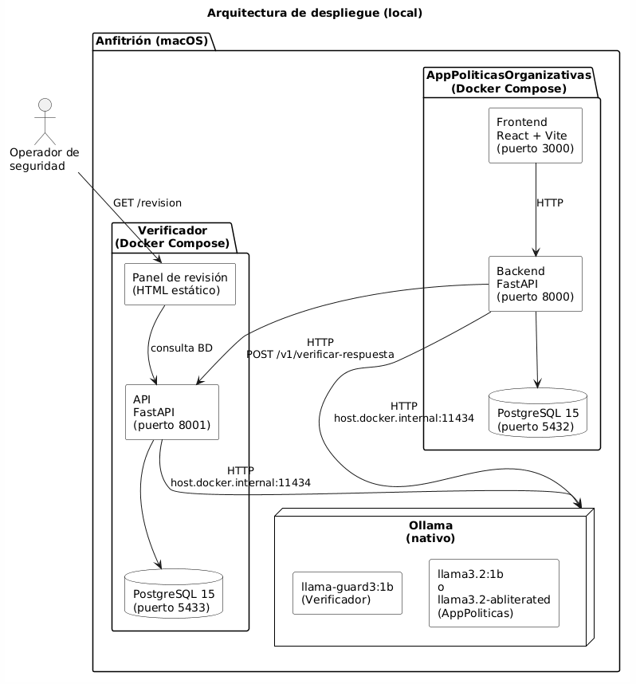
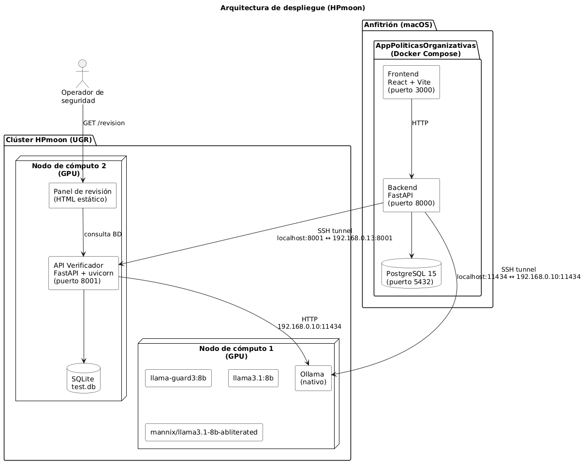

# Verificador Multicapa de Seguridad para Interacciones con LLMs

Este repositorio contiene el código fuente desarrollado para el TFM del Máster en Ingeniería Informática de la Universidad de Granada.

El proyecto aborda los riesgos de seguridad introducidos por la adopción de Modelos de Lenguaje de Gran Escala (LLMs) en infraestructuras locales. Para ello, propone un **sistema de verificación externo (Agente Verificador)** que audita en tiempo real las llamadas a herramientas (*tool calls*) y las respuestas de chat. Para validar su eficacia, se incluye también el **Sistema I: Aplicación de Políticas Organizativas**, que consume modelos alineados y abliterados (sin censura) para forzar escenarios de ataque real.

## Arquitectura del Proyecto

El proyecto se compone de dos servicios independientes. AppPoliticasOrganizativas sigue una arquitectura de tres niveles (frontend React, backend FastAPI y base de datos PostgreSQL), cada uno en su propio contenedor Docker. El Verificador es un servicio backend con un pipeline secuencial de cuatro capas de seguridad (allowlist, pattern matching, sandbox y juez semántico), acompañado de un panel de revisión HTML estático. Ambos servicios comparten el acceso a Ollama, que se ejecuta de forma nativa en el anfitrión para aprovechar la aceleración GPU.



Para las pruebas con modelos de mayor tamaño, el sistema se despliega en el clúster HPmoon de la UGR mediante túneles SSH.



El repositorio se divide en dos carpetas principales:

### 1. `/AgenteVerificador` (Sistema II)
Sistema de defensa en profundidad que evalúa las peticiones antes de su ejecución o visualización. Implementa un *pipeline* de cuatro capas secuenciales:
1. **Allowlist**: Aprobación de operaciones conocidas y seguras.
2. **Pattern Matching**: Comparación con 55 firmas OWASP.
3. **Sandbox Guard**: Bloqueo de cruces de directorios (*path traversal*).
4. **Juez Semántico**: Evaluación cognitiva mediante LLMs (LlamaGuard3 y TS-Guard).

### 2. `/AppPoliticasOrganizativas` (Sistema I)
Aplicación web desarrollada en React y FastAPI que permite generar documentos normativos a partir de contextos en lenguaje natural. Esta aplicación consume el Verificador como un servicio independiente para proteger a los usuarios frente a respuestas dañinas.

---

## Tecnologías y Componentes

- **Frontend:** React + Vite
- **Backend y API:** Python 3.11, FastAPI, SQLAlchemy, Pydantic
- **Base de Datos:** PostgreSQL 15 Alpine (desplegada vía Docker)
- **Orquestación:** Docker y Docker Compose
- **Motor de Inferencia LLM:** Ollama
- **Modelos Utilizados:** `llama3.2:1b` y `llama3.2:8b` (App), `llama-guard3:1b` y `llama-guard3:8b` (Verificador de chat), `ts-guard` (Verificador de tools) y variantes abliteradas con *Heretic*

---

## Requisitos Previos

Antes de desplegar el sistema, asegúrate de tener instalados los siguientes componentes:

- **Docker Desktop** 
- **Ollama** 
- **Git**
- Espacio en disco: ~15 GB (principalmente para los modelos LLM)
- RAM: 8 GB (si se dispone de más se podrán probar modelos mejores)

---

## Instalación y Despliegue

### 1. Iniciar Ollama y descargar modelos

El motor de inferencia debe ejecutarse de forma nativa. Inicia el servicio y descarga los modelos base:

```bash
ollama serve
ollama pull llama3.2:1b
ollama pull llama-guard3:8b
```

Para utilizar el modelo abliterado y TS-Guard, consulta la memoria del proyecto para ver las instrucciones de conversión de `.safetensors` a `.gguf` e importación mediante `Modelfile`.

### 2. Clonar el repositorio

```bash
git clone https://github.com/cristinadam1/Trabajo-Fin-de-Master.git
cd Trabajo-Fin-de-Master
```

### 3. Despliegue del Agente Verificador

```bash
cd AgenteVerificador
docker compose up --build -d
```

### 4. Despliegue de la App de Políticas Organizativas

```bash
cd ../AppPoliticasOrganizativas
docker compose up --build -d
```

---

## Uso y Puertos

Una vez que todos los contenedores estén levantados, los servicios estarán disponibles en los siguientes puertos:

| Servicio | URL |
|---|---|
| Frontend (App Políticas) | `http://localhost:3000` |
| API Backend (App Políticas) | `http://localhost:8000` |
| API Verificador | `http://localhost:8001` |
| Panel de Revisión Humana | `http://localhost:8001/revision` |
| Ollama | `http://localhost:11434` |

---

## Detención del sistema

Para detener los contenedores, ejecuta en cada carpeta:

```bash
docker compose down
```

Si deseas borrar la base de datos y empezar de cero, añade el flag `-v`:

```bash
docker compose down -v
```

---

## Licencia y Autoría

**Autora:** Cristina del Águila Martín  
**Trabajo Fin de Máster** - Máster Universitario en Ingeniería Informática  
**Universidad de Granada** - 2026
